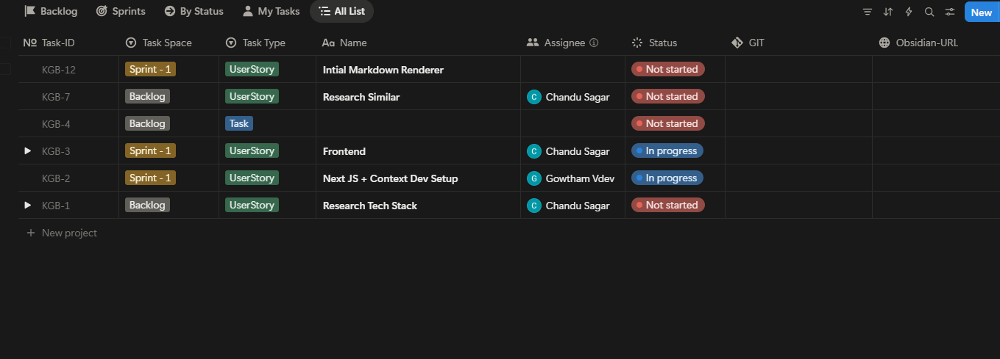

[PRODUCT BACKLOG](../docs/project_management/Product_Backlog.md)

 - just for your reference for understanding my tasks and properties 

My points for you to understand my task:
1. Work on the **Product Backlog** file where all features involved in the project are listed.
2. The current backlog template is difficult to read, especially with automatically generated tasks.
3. The goal is to make the product backlog very simple and easy to understand.
4. i am manullay Syncing the product backlog with the current task scheduler application **Notion**, used like JIRA.
5. I am using Notion to create user stories, feature-related tasks, and manage sprints.
6. A Notion task management setup has been attached to provide better understanding.
7. Ensure clear alignment between Notion tasks and the actual development product backlog especially i want to maitain the TaskID.
8. All developers work with Git, so the backlog should clearly reflect development work.
9. The backlog does not need full automatic sync with Notion, as items will be added manually.
10. The main requirement is to make the backlog more readable and understandable.
11. Unwanted properties like `compliance: []`, `effort_estimate: "S / M / L"`, and `priority_score` using RICE with score `0` are confusing.
12. The backlog should clearly show what can be picked and moved into active tasks.
13. There is confusion around the **product management folder**, which is the main place to add features and task details.
14. This folder follows the **BMAD approach**, where remaining files are auto-generated and handled by agents.
15. Developers need to be very careful with this folder to provide clear context of what is being built.

 Suggest changes to the Product Backlog file to make it simpler and more readable for developers.

suggest what changes we can do to this file to make more simple , redable for developer 