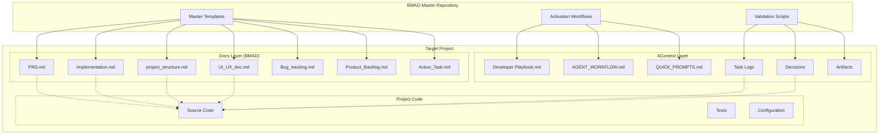

# BMAD Activation System Design

## Overview

The BMAD Activation System is designed as a portable, self-contained documentation and workflow framework that can be cloned into any project to establish context-driven development practices. The system consists of three main components: the Core BMAD Documentation Templates, the AContext Execution Layer, and the Activation Toolkit that customizes and deploys the system for specific projects.

The architecture follows a template-based approach where a master repository contains all necessary documentation templates, workflow scripts, and activation tools. When deployed to a new project, the system creates a customized instance while maintaining the core structure and principles.

## Architecture

### High-Level System Architecture



### Component Architecture

#### 1. Master Template Repository
- **Template Engine**: Processes template files with placeholder substitution
- **Validation Engine**: Ensures template integrity and completeness
- **Activation Scripts**: Automates deployment and customization
- **Version Management**: Tracks template versions and provides migration paths

#### 2. BMAD Documentation Layer
- **Static Templates**: Core documentation structure that remains consistent
- **Dynamic Content**: Project-specific information injected during activation
- **Cross-Reference System**: Maintains links between related documents
- **Validation Rules**: Ensures documentation consistency and completeness

#### 3. AContext Execution Layer
- **Workflow Engine**: Guides users through structured development processes
- **Logging System**: Captures execution history and decision rationale
- **Context Retrieval**: Provides efficient access to historical information
- **Integration Hooks**: Connects with development tools and CI/CD systems

## Components and Interfaces

### Core Components

#### 1. Activation Engine
```typescript
interface ActivationEngine {
  validateTarget(projectPath: string): ValidationResult;
  customizeTemplates(config: ProjectConfig): TemplateSet;
  deployDocumentation(templates: TemplateSet, targetPath: string): DeploymentResult;
  setupWorkflows(projectType: ProjectType): WorkflowConfig;
}
```

**Responsibilities:**
- Analyze target project structure and requirements
- Customize templates based on project configuration
- Deploy documentation with proper cross-references
- Configure workflows for project-specific needs

#### 2. Template Management System
```typescript
interface TemplateManager {
  loadTemplates(version?: string): TemplateSet;
  validateTemplate(template: Template): ValidationResult;
  processPlaceholders(template: Template, context: ProjectContext): ProcessedTemplate;
  generateCrossReferences(templates: TemplateSet): ReferenceMap;
}
```

**Responsibilities:**
- Manage template versions and compatibility
- Process dynamic content and placeholders
- Generate cross-reference links between documents
- Validate template structure and content

#### 3. Workflow Orchestrator
```typescript
interface WorkflowOrchestrator {
  initializeWorkflow(workflowType: WorkflowType): Workflow;
  validateStep(step: WorkflowStep, context: ExecutionContext): StepResult;
  captureDecision(decision: Decision, rationale: string): DecisionRecord;
  updateTaskStatus(taskId: string, status: TaskStatus): void;
}
```

**Responsibilities:**
- Guide users through structured development workflows
- Validate workflow step completion
- Capture and store decision rationale
- Maintain task status and progress tracking

#### 4. Context Management System
```typescript
interface ContextManager {
  createTaskLog(taskId: string, template: TaskTemplate): TaskLog;
  searchHistory(query: SearchQuery): SearchResult[];
  generateContextBundle(featureId: string): ContextBundle;
  archiveCompletedWork(criteria: ArchiveCriteria): ArchiveResult;
}
```

**Responsibilities:**
- Create and manage task execution logs
- Provide efficient search and retrieval of historical context
- Generate curated context bundles for onboarding
- Archive completed work to maintain system performance

### Interface Specifications

#### Project Configuration Interface
```typescript
interface ProjectConfig {
  name: string;
  type: ProjectType;
  techStack: TechStack;
  teamSize: number;
  developmentPhase: DevelopmentPhase;
  customizations: {
    workflows: WorkflowCustomization[];
    templates: TemplateCustomization[];
    integrations: IntegrationConfig[];
  };
}
```

#### Workflow Definition Interface
```typescript
interface WorkflowDefinition {
  id: string;
  name: string;
  description: string;
  phases: WorkflowPhase[];
  validationRules: ValidationRule[];
  artifacts: ArtifactDefinition[];
}
```

#### Task Log Interface
```typescript
interface TaskLog {
  id: string;
  title: string;
  status: TaskStatus;
  bmadReferences: DocumentReference[];
  executionSteps: ExecutionStep[];
  decisions: Decision[];
  artifacts: Artifact[];
  outcome: TaskOutcome;
  nextSteps: string[];
}
```

## Data Models

### Core Data Structures

#### 1. Project Context Model
```typescript
interface ProjectContext {
  metadata: {
    name: string;
    version: string;
    createdAt: Date;
    lastUpdated: Date;
    owner: string;
  };
  configuration: ProjectConfig;
  documentation: {
    bmadDocs: DocumentMap;
    acontextLogs: TaskLogMap;
    decisions: DecisionMap;
  };
  workflow: {
    currentStage: string;
    activeTasks: Task[];
    completedTasks: Task[];
    blockedTasks: Task[];
  };
}
```

#### 2. Template Model
```typescript
interface Template {
  id: string;
  name: string;
  version: string;
  content: string;
  placeholders: Placeholder[];
  dependencies: string[];
  validationRules: ValidationRule[];
  metadata: {
    description: string;
    category: TemplateCategory;
    lastUpdated: Date;
    author: string;
  };
}
```

#### 3. Workflow State Model
```typescript
interface WorkflowState {
  currentPhase: WorkflowPhase;
  completedSteps: WorkflowStep[];
  pendingSteps: WorkflowStep[];
  blockedSteps: WorkflowStep[];
  context: ExecutionContext;
  history: WorkflowEvent[];
}
```

### Data Relationships

- **Project Context** contains multiple **Templates** and **Workflows**
- **Templates** can reference other **Templates** through dependencies
- **Workflows** consist of multiple **Phases** which contain **Steps**
- **Task Logs** reference **BMAD Documents** and contain **Decisions**
- **Decisions** can be promoted to **Architecture Decisions** in the decisions folder

## Error Handling

### Error Categories and Strategies

#### 1. Template Processing Errors
- **Missing Placeholders**: Provide clear error messages with suggested values
- **Invalid Template Structure**: Validate against schema and provide specific feedback
- **Circular Dependencies**: Detect and report dependency cycles with resolution suggestions

#### 2. Workflow Execution Errors
- **Step Validation Failures**: Guide users to correct issues with specific instructions
- **Missing Prerequisites**: Check and report missing dependencies or context
- **Context Inconsistencies**: Detect and help resolve conflicts between documents

#### 3. System Integration Errors
- **File System Access**: Handle permissions and path issues gracefully
- **Version Conflicts**: Provide migration paths and compatibility warnings
- **Configuration Errors**: Validate configuration and suggest corrections

### Error Recovery Mechanisms

#### Graceful Degradation
- Continue operation with reduced functionality when non-critical components fail
- Provide manual override options for automated processes
- Maintain system state consistency during error conditions

#### Rollback Capabilities
- Track changes during activation process for potential rollback
- Provide checkpoint system for long-running operations
- Maintain backup of original state before modifications

#### User Guidance
- Provide actionable error messages with specific resolution steps
- Include links to documentation and troubleshooting guides
- Offer automated fixes where possible

## Testing Strategy

### Testing Pyramid

#### 1. Unit Tests (70%)
- **Template Processing**: Test placeholder substitution, validation, and cross-reference generation
- **Workflow Logic**: Test step validation, state transitions, and decision capture
- **Context Management**: Test search, retrieval, and archiving functionality
- **Configuration Handling**: Test project configuration parsing and validation

#### 2. Integration Tests (20%)
- **End-to-End Activation**: Test complete activation process from template to deployed system
- **Workflow Execution**: Test multi-step workflows with real documentation updates
- **Cross-Document References**: Test link generation and validation across document types
- **File System Operations**: Test template deployment and file management

#### 3. System Tests (10%)
- **Real Project Scenarios**: Test activation on various project types and configurations
- **Performance Testing**: Test system performance with large projects and extensive history
- **Compatibility Testing**: Test with different operating systems and development environments
- **User Acceptance Testing**: Validate workflows with real developers and teams

### Test Data Management

#### Test Project Templates
- Maintain sample projects of different types for testing
- Include edge cases and complex scenarios
- Provide both minimal and comprehensive project examples

#### Mock Data Generation
- Generate realistic task logs and decision histories
- Create various project configurations for testing
- Simulate different team sizes and development phases

### Continuous Testing

#### Automated Test Execution
- Run tests on every commit to template repository
- Test activation process with multiple project configurations
- Validate generated documentation for consistency and completeness

#### Quality Gates
- Require all tests to pass before template updates
- Validate documentation quality and completeness
- Check for breaking changes in template structure

## Performance Considerations

### Scalability Requirements

#### Template Processing
- Support projects with hundreds of documentation files
- Handle large template sets efficiently
- Optimize placeholder processing for complex substitutions

#### Context Search and Retrieval
- Provide fast search across thousands of task logs
- Implement efficient indexing for historical data
- Support real-time context updates during development

#### Workflow Execution
- Handle concurrent workflow execution by multiple team members
- Maintain consistency during parallel document updates
- Optimize validation processes for large projects

### Optimization Strategies

#### Caching
- Cache processed templates to avoid recomputation
- Store search indices for fast context retrieval
- Cache validation results for unchanged documents

#### Lazy Loading
- Load templates and context on demand
- Defer expensive operations until required
- Implement progressive loading for large datasets

#### Resource Management
- Monitor memory usage during large operations
- Implement cleanup for temporary files and data
- Optimize file I/O operations for better performance